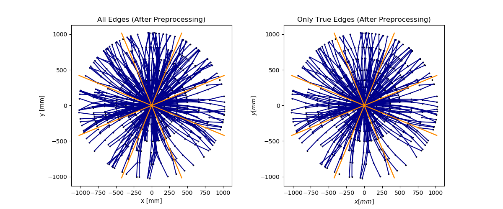
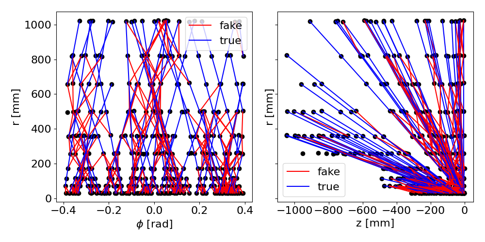
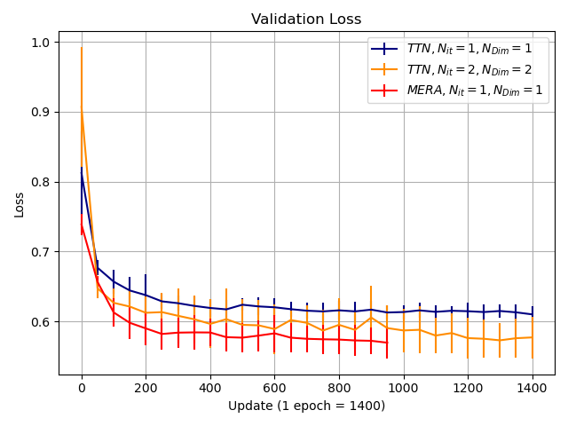
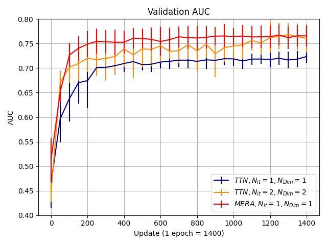

# Particle Track Reconstruction with Quantum Algorithms

Presented  most recent results @ Connecting The Dots 2020, talk is [here](https://indico.cern.ch/event/831165/contributions/3717116/).

Presented @ CERN openlab Technical Workshop 2020 is [here](https://indico.cern.ch/event/853334/contributions/3688457/).

CHEP 2019 proceeding submitted and available as a preprint [here](https://arxiv.org/abs/2003.08126).

The scripts used to produce CHEP 2019 results is at trying_things/QuantumEdgeNetwork.py

Notice that this is a project in progress. Latest results are produced using train.py and are different from the ones in the proceeding.

*The repository has many scripts which are not complete! Work in Progress!*

## A preprocessed event example

  

  

  

## Recent Results

  

 