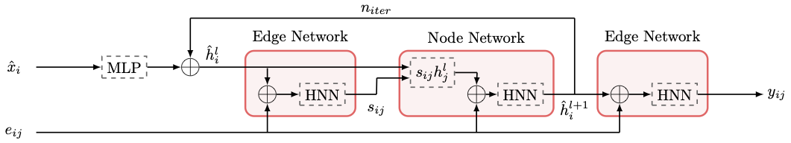
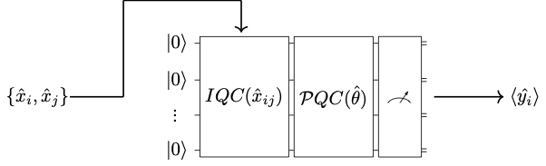

# Particle Track Reconstruction with Quantum Algorithms

## News:

The final version of this project is released on a different repository. You can access it through this [link](https://github.com/QTrkX/qtrkx-gnn-tracking). 

Presented  most recent results at Connecting The Dots 2020, talk is [here](https://indico.cern.ch/event/831165/contributions/3717116/). Proceeding is available as a preprint [here](https://arxiv.org/abs/2007.06868)

Latest updates are presented at CERN openlab Technical Workshop 2020. Presentation is [here](https://indico.cern.ch/event/853334/contributions/3688457/).

CHEP 2019 proceeding submitted and available as a preprint [here](https://arxiv.org/abs/2003.08126).

## How to use?

Use [```train.py```](./train.py) to train a model. Models are available in [```./qnetworks```](./qnetworks) folder. Choose the model and other hyperparameters using a configuration file (see [```./configs```](./configs) folder for examples).

Execute the following to train the model. 

``` python3 train.py [PATH-TO-CONFIG-FILE] ```

Note: 1 epoch takes ~1 week when a GPU is used to simulate quantum circuits.

# A brief look at the data and the models used

## A preprocessed event example
<p align="center">
  
</p>

# A subgraph example
All events are divided to 8 in $\eta$ direction and 2 in $z$ direction. Therefore, 1 event contains 16 subgraphs. In this work we preprocessed 100 events to create 1600 subgraphs. 1400 is used for training, while 200 is left for validation.
<p align="center">
  
</p>

<p align="center">
  
</p>

## Hybrid Quantum Classical Graph Neural Network Model used:

<p align="center">
  
</p>

## Quantum Network Structure:

First the data is encoded via a IQC layer, then a PQC is applied to the circuit. Then, the measurements are taken and expectation values are calculated by taking averages of them.

<p align="center">
  
</p>

## Recent Results

<p align="center">
  
  
</p>

## Disclaimer
Notice that this is a project in progress. Latest results are always updated and might be different from the proceeding.

*The repository has many scripts which are not complete! Work in Progress!*
